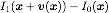
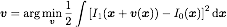
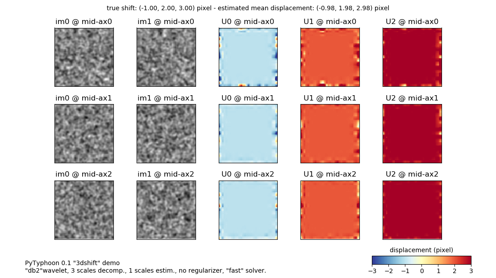
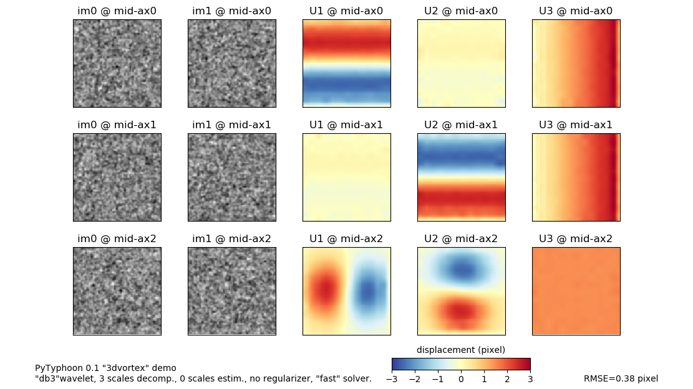

# PyTyphoon
Python implementation of [Typhoon motion estimator](http://www.pierrederian.net/typhoon.html): dense estimation of 2D/3D optical flow on wavelet bases, primarily aimed at **fluid motion estimation**.

## Important remarks
At the moment, the wavelet-based data DFD term [(D&eacute;rian et al., 2013)] only is provided: the **high-order regularizers** [(Kadri-Harouna et al., 2013)] **are not included** in this implementation.

The reference implementation used in [(D&eacute;rian et al., 2015)] and [(D&eacute;rian et al., 2017)] is written in C++ and GPU-accelerated with CUDA, and contains the high-order regularizers. It is the property of Inria (FR) and the CSU Chico Research
Foundation (Ca, USA), and can be licensed from these institutions.
**This Python implementation is not the same as the
reference** for many reasons, and it is obviously much slower.

## Requirements
- [Numpy, Scipy](https://scipy.org/);
- [PyWavelets](https://github.com/PyWavelets/pywt);
- [Matplotlib](https://matplotlib.org/) for the demos.

Tested with Anaconda Python 3.6.1, Numpy 1.12.1, Scipy 0.19.1, PyWavelet 0.5.2.

## Usage
The `Typhoon` class can be imported from other modules/scripts to perform estimations as needed.

The script can also work as a standalone estimator in simple cases, e.g.:
```
python pytyphoon.py -i0 path/to/im0.jpg -i1 path/to/im1.jpg -wav 'db3' --display
```
will solve the problem for image pair (`im0.jpg`, `im1.jpg`) and wavelet Daubechies-3.
See `python pytyphoon.py -h` for the complete list of parameters.

## How does it work?

Typhoon solves a **dense variational optical flow** problem, that is to say: (i) it provides one motion vector at every pixel of input images and (ii) it estimates the entire vector field altogether.

To do so, it looks for the motion field which minimizes the **displaced frame difference** (DFD):



This is achieved by minimizing the following functional:



where the integral is taken over the image.
The functional above is **non-linear with respect to the motion field**.
This has the advantage of better handling large displacement, but complicates the minimization process.

For the non-linear minimization to succeed, the solution should lie reasonable "close" to the first guess. This is where **wavelets bases** come into play: by providing a multiscale representation of the motion field, they enable to estimate the motion iteratively from its coarsest scales to the finests.

The minimization is handled by L-BFGS, which is efficient memory-wise and only requires the functional value and its gradient.

## Demos

These demos are shipped with the project.

### (2D) Synthetic particle images
Simple 2d estimation using synthetic particle images (256x256 pixels) originally created for the [FLUID project](http://fluid.irisa.fr/data-eng.htm) (image database #1). Run:
```
python pytyphoon.py --demo particles
```


### (3D) Homogeneous shift
Simple 3d estimation using synthetic images (64x64x64 pixels) obtained by filtering random normal noise at various scales. The displacements are integer shifts along each of the 3 dimensions. Run:
```
python pytyphoon.py --demo 3dshift
```


### (3D) Column vortex
Simple 3d estimation using synthetic images (96x96x96 pixels) obtained by filtering random normal noise at various scales. The displacement field is a column vortex (first two axes) with an updraft increasing linearly along the third axis. Run:
```
python pytyphoon.py --demo 3dvortex
```


## References
- [(D&eacute;rian et al., 2017)]
    D&eacute;rian, P. & Almar, R.
    "Wavelet-based Optical Flow Estimation of Instant Surface Currents from Shore-based and UAV Video".
    _IEEE Transactions on Geoscience and Remote Sensing_, Vol. 55, pp. 5790-5797, 2017.
- [(D&eacute;rian et al., 2015)]
     D&eacute;rian, P.; Mauzey, C. F. and Mayor, S. D.
    "Wavelet-based optical flow for two-component wind field estimation from single aerosol lidar data".
    _Journal of Atmospheric and Oceanic Technology_, Vol. 32, pp. 1759-1778, 2015.
- [(D&eacute;rian et al., 2013)]
    D&eacute;rian, P.; H&eacute;as, P.; Herzet, C. & M&eacute;min, E.
    "Wavelets and Optical Flow Motion Estimation".
    _Numerical Mathematics: Theory, Method and Applications_, Vol. 6, pp. 116-137, 2013.
- [(Kadri-Harouna et al., 2013)] Kadri Harouna, S.; D&eacute;rian, P.; H&eacute;as, P. and     M&eacute;min, E.
   "Divergence-free Wavelets and High Order Regularization".
   _International Journal of Computer Vision_, Vol. 103, pp. 80-99, 2013.

[(D&eacute;rian et al., 2017)]: http://ieeexplore.ieee.org/stamp/stamp.jsp?tp=&arnumber=7964775&isnumber=8049540
[(D&eacute;rian et al., 2015)]: http://journals.ametsoc.org/doi/abs/10.1175/JTECH-D-15-0010.1
[(D&eacute;rian et al., 2013)]: https://www.cambridge.org/core/journals/numerical-mathematics-theory-methods-and-applications/article/wavelets-and-optical-flow-motion-estimation/2A9D13B316F000F0530AD42621B42FFD
[(Kadri-Harouna et al., 2013)]: https://link.springer.com/article/10.1007/s11263-012-0595-7

## Todo
- **NetCDF for output results?** in standalone mode;
- support of masks;
- some regularizers;
- alternative penalization functions;
- divergence-free wavelets;
- ...
